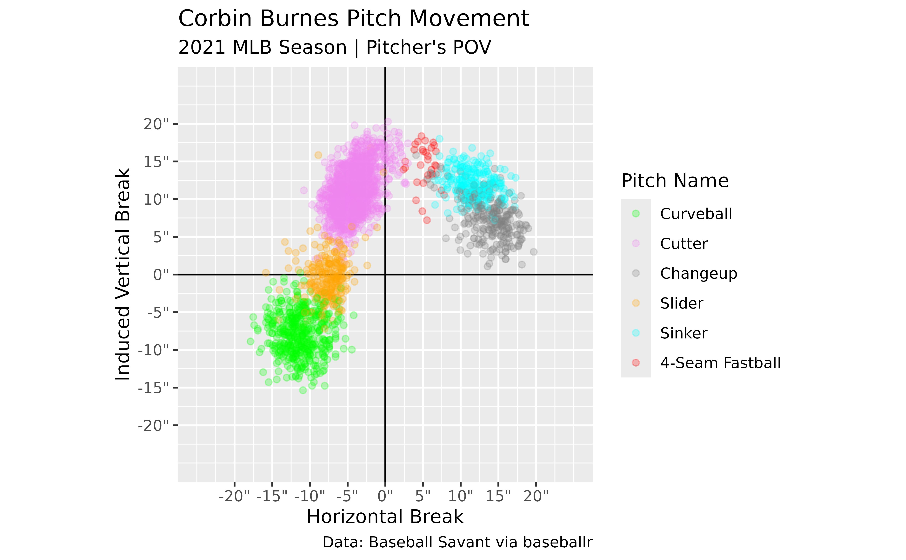
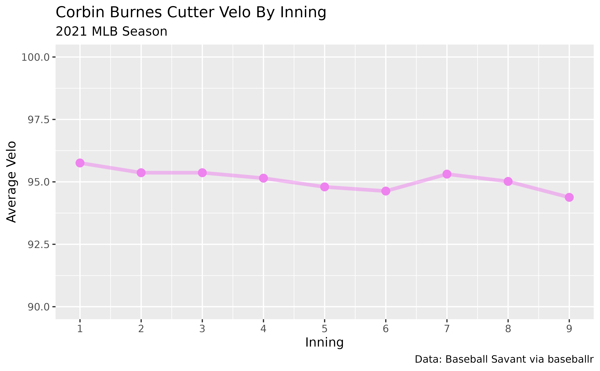

# Using Statcast Pitch Data

In this example, the `baseballr` package is used to acquire Statcast
data for Corbin Burnes for the 2021 season.

This data is then used to generate different plots to showcase his
arsenal and his cutter’s velocity by inning.

## Load Packages

``` r

library(baseballr)
library(dplyr)
#> 
#> Attaching package: 'dplyr'
#> The following objects are masked from 'package:stats':
#> 
#>     filter, lag
#> The following objects are masked from 'package:base':
#> 
#>     intersect, setdiff, setequal, union
library(ggplot2)
```

## Find Corbin Burnes’ MLBAM ID

``` r

burnes_id <- baseballr::playerid_lookup(last_name = "Burnes", first_name = "Corbin") %>% 
  dplyr::pull(mlbam_id)
```

## Use Burnes’ ID To Load Statcast Data

``` r

burnes_data <- baseballr::statcast_search_pitchers(start_date = "2021-03-01",
                                                   end_date = "2021-12-01",
                                                   pitcherid = burnes_id)
```

This block will download all of Corbin Burnes’ pitches from March 1st
through December 1st.

## Clean Data

If this is your first time looking at Statcast data I recommend looking
at their [documentation](https://baseballsavant.mlb.com/csv-docs) for
for the dataset returned. It’ll walk you through the data represented by
each column and give you a better idea of the data points collected for
each pitch.

Some of the more common data points used for pitching analysis:

- `pitcher` : Pitcher’s MLBAM ID
- `pitch_name`/`pitch_type` : Pitch Name/Type
- `release_speed` : Velocity
- `pfx_z`/`pfx_x` : Pitch Movement
- `release_spin_rate` : Spin Rate
- `spin_axis` : Spin Axis
- `release_pos_z`/`release_pos_z`/`extension` : Release Point
- `plate_z`/`plate_x` : Pitch Location

Since we’re going to be making a scatterplot of Corbin Burnes’ pitch
movement, we need to make sure we have the data in the proper format to
match a traditional movement plot. The `pfx_x` and `pfx_z` columns are
both in feet so let’s create two new columns and convert them to inches.
`pfx_x` is also from the catcher’s point of view so let’s also reverse
it to be from the pitcher’s.

``` r

# The glimpse function is something I use regularly
# to quickly preview the data I'm working with.
# Try it out if you haven't used it before!
# 
# 
# burnes_data %>% dplyr::glimpse()

burnes_cleaned_data <- burnes_data %>% 
  # Only keep rows with pitch movement readings
  # and during the regular season
  dplyr::filter(!is.na(pfx_x), !is.na(pfx_z),
                game_type == "R") %>% 
  dplyr::mutate(pfx_x_in_pv = -12*pfx_x,
                pfx_z_in = 12*pfx_z)
  
```

## Create A Movement Plot

Now that we’ve created our new columns, let’s use them to plot how
Corbin Burnes’ pitches move.

``` r

# Make a named vector to scale pitch colors with
pitch_colors <- c("4-Seam Fastball" = "red",
                  "2-Seam Fastball" = "blue",
                  "Sinker" = "cyan",
                  "Cutter" = "violet",
                  "Fastball" = "black",
                  "Curveball" = "green",
                  "Knuckle Curve" = "pink",
                  "Slider" = "orange",
                  "Changeup" = "gray50",
                  "Split-Finger" = "beige",
                  "Knuckleball" = "gold")

# Find unique pitch types to not have unnecessary pitches in legend
burnes_pitch_types <- unique(burnes_cleaned_data$pitch_name)

burnes_cleaned_data %>% 
  ggplot2::ggplot(ggplot2::aes(x = pfx_x_in_pv, y = pfx_z_in, color = pitch_name)) +
  ggplot2::geom_vline(xintercept = 0) +
  ggplot2::geom_hline(yintercept = 0) +
  # Make the points slightly transparent
  ggplot2::geom_point(size = 1.5, alpha = 0.25) +
  # Scale the pitch colors to match what we defined above
  # and limit it to only the pitches Burnes throws
  ggplot2::scale_color_manual(values = pitch_colors,
                              limits = burnes_pitch_types) +
  # Scale axes and add " to end of labels to denote inches
  ggplot2::scale_x_continuous(limits = c(-25,25),
                              breaks = seq(-20,20, 5),
                              labels = scales::number_format(suffix = "\"")) +
  ggplot2::scale_y_continuous(limits = c(-25,25),
                              breaks = seq(-20,20, 5),
                              labels = scales::number_format(suffix = "\"")) +
  ggplot2::coord_equal() +
  ggplot2::labs(title = "Corbin Burnes Pitch Movement",
                subtitle = "2021 MLB Season | Pitcher's POV",
                caption = "Data: Baseball Savant via baseballr", 
                x = "Horizontal Break",
                y = "Induced Vertical Break",
                color = "Pitch Name")
```



I like to use `pitch_name` to color my scatterplots as it gives the full
pitch name in the legend, but `pitch_type` would also work if you prefer
the shorter abbreviations (ex: 4-Seam Fastball = FF). If you were to use
`pitch_type` instead, be sure to make a new vector for the colors.

## Velo By Inning

Now let’s take a look at Corbin Burnes’ pitch velo by inning for his
trademark cutter.

``` r


burnes_velo_by_inning <- burnes_cleaned_data %>% 
  dplyr::filter(pitch_name == "Cutter") %>% 
  dplyr::group_by(inning, pitch_name) %>% 
  dplyr::summarize(average_velo = mean(release_speed, na.rm = TRUE))
#> `summarise()` has regrouped the output.
#> ℹ Summaries were computed grouped by inning and pitch_name.
#> ℹ Output is grouped by inning.
#> ℹ Use `summarise(.groups = "drop_last")` to silence this message.
#> ℹ Use `summarise(.by = c(inning, pitch_name))` for per-operation
#>   grouping (`?dplyr::dplyr_by`) instead.

burnes_velo_by_inning %>% 
  ggplot2::ggplot(ggplot2::aes(x = inning, y = average_velo, color = pitch_name)) +
  ggplot2::geom_line(size = 1.5, alpha = 0.5, show.legend = FALSE) +
  ggplot2::geom_point(size = 3, show.legend = FALSE) +
  ggplot2::scale_color_manual(values = pitch_colors) +
  ggplot2::scale_x_continuous(breaks = 1:9) +
  ggplot2::scale_y_continuous(limits = c(90, 100)) +
  ggplot2::labs(title = "Corbin Burnes Cutter Velo By Inning",
                subtitle = "2021 MLB Season",
                caption = "Data: Baseball Savant via baseballr",
                x = "Inning",
                y = "Average Velo")
#> Warning: Using `size` aesthetic for lines was deprecated in ggplot2 3.4.0.
#> ℹ Please use `linewidth` instead.
#> This warning is displayed once per session.
#> Call `lifecycle::last_lifecycle_warnings()` to see where this warning
#> was generated.
```



## Conclusion

These were just two examples of things you can do with pitch data
acquired using baseballr. Statcast data goes back to 2015 and contains a
multitude of data points for each pitch/batted ball event so there’s
endless things to go research!
